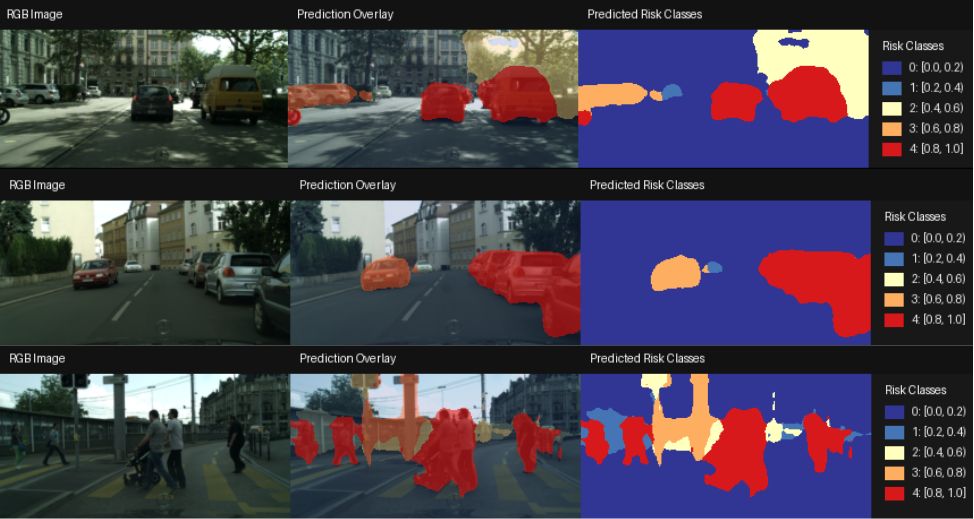
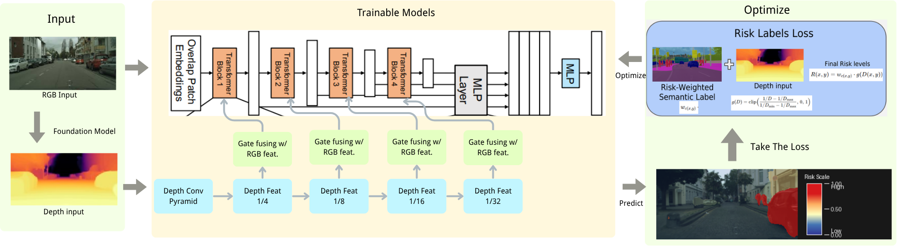
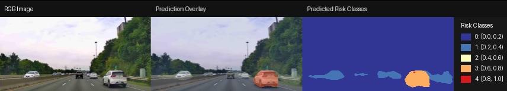

# RiskDrive: Multimodal-Based Risk Map Prediction for Autonomous Driving

Dense **5-class per-pixel risk maps** from **RGB-D** input for autonomous driving. Higher risk indicates regions that are more critical for ego-vehicle safety (e.g. nearby pedestrians and vehicles). The main model is a **depth-aware SegFormer** (RiskDrive); a lightweight **CNN baseline** is included for comparison.

**Course:** APS360 – Applied Fundamentals of Deep Learning (University of Toronto)  
**Author:** Runhao Li · [rainli@mail.utoronto.ca](mailto:rainli@mail.utoronto.ca) · [github.com/rainli10/riskmap](https://github.com/rainli10/riskmap)

---

## Predicted risk map



---

## Pipeline

End-to-end view of data and model flow (RGB, depth, semantics → risk supervision → SegFormer-style prediction).



---

## Method

- **Supervision:** Cityscapes RGB + semantic maps + monocular depth (e.g. from a foundation depth model). Per-pixel risk combines a class risk weight **w_c** with a normalized proximity term from depth **g(D)**:

$$
g(D) = \mathrm{clip}\left( \frac{1/D - 1/D_{\max}}{1/D_{\min} - 1/D_{\max}}, 0, 1 \right)
$$

$$
R(x,y) = w_{c(x,y)} \cdot g\left(D(x,y)\right)
$$

Plain-text form (any Markdown viewer):

```
g(D) = clip( (1/D - 1/D_max) / (1/D_min - 1/D_max), 0, 1 )
R(x,y) = w[c(x,y)] * g(D(x,y))
```

- **Model:** SegFormer backbone on RGB, with depth processed through a shallow conv pyramid and **gated fusion** into the transformer stages, then the standard MLP decoder for dense **5-way** risk classification.
- **Training:** Staged fine-tuning (frozen backbone → full model), AdamW, cosine schedule, AMP on CUDA (see `train_ours.py`).

---

## Real-world driving testing

Qualitative result on self-collected **Don Valley Parkway (Toronto)** footage (no GT semantics; illustration only).



The project report also discusses **KITTI-360** and quantitative comparison vs. the CNN baseline.

---

## Input / output

| | |
|--|--|
| **Input** | 4-channel tensor: RGB + normalized depth (aligned H×W). |
| **Output** | Per-pixel risk in **5 discrete bins** (mapped to representative scores for visualization and MAE-style metrics). |

---

## Repository map

| Path | Role |
|------|------|
| `dataloader.py` | `RiskMapDataset`, blocked/dense risk targets, depth weighting. |
| `model.py` | `SegFormerRisk`, simple CNN baseline. |
| `train_ours.py` | Main SegFormer / transfer training. |
| `train.py` | Baseline training hooks and shared constants. |
| `validation_ours.py` | Checkpoint validation, metrics, comparison PNGs. |
| `inference.py` / `test.py` | Single-folder or filtered-sample inference (see file headers). |
| `prepare_test_folder.py` | Convert `test/images` + `test/depth` (+ optional `test/label`) to dataset layout; optional WebM; fixed 256×128 export. |
| `prepare_inference_ours.py` | One-off bundle → `image_png` / `depth` / `label` for `RiskMapDataset`. |

---

## Data layout (standard sample)

```
<dataset_root>/
  image_png/<id>.png
  depth/<id>.npy      # float32, same size as image; scaled by depth_max in code
  label/<id>.npy      # int class ids (Cityscapes-style trainIds; unknown ids → weight 0 in risk build)
```

---

## Requirements

Python 3.10+, PyTorch, Transformers (SegFormer), PIL, NumPy; OpenCV recommended for `prepare_test_folder.py` (video/WebM). Install your stack to match your CUDA version.

---

## Ethics note

Uses public driving datasets with standard anonymization. Risk maps follow **heuristic** semantics + geometry; they are research prototypes, not safety-certified perception for real vehicles.
